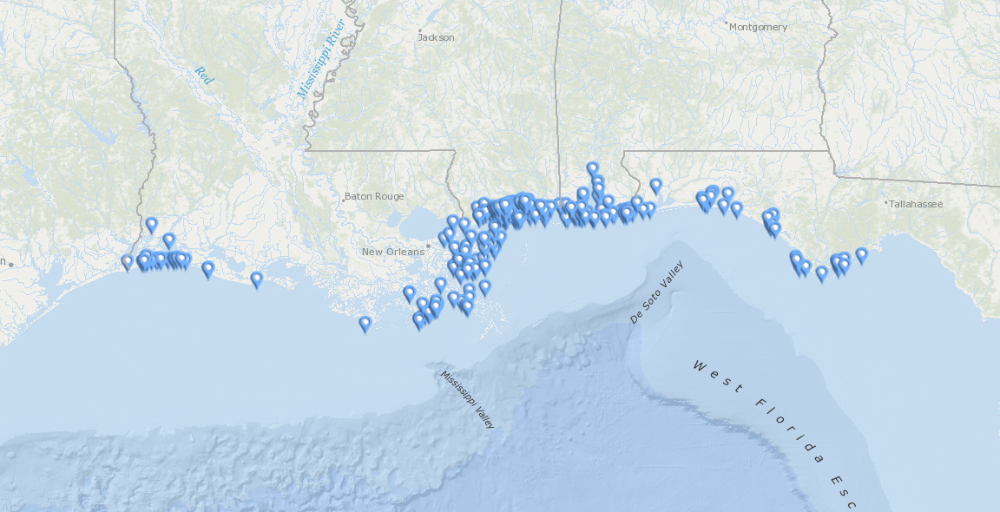

```{r setup, include=FALSE}
knitr::opts_chunk$set(echo = TRUE)
knitr::opts_chunk$set(message = FALSE)
knitr::opts_chunk$set(warning = FALSE)
knitr::opts_chunk$set(fig.width = 10)
library(tidyverse)
library(spatstat)
```

### Part A

The [data](https://www.fisheries.noaa.gov/resource/map/2019-bottlenose-dolphin-northern-gulf-mexico-unusual-mortality-event-dead-animal) we will be exploring today are the locations of sightings of bottlenose dolphin (_Tursiops truncatus_) carcasses in the northern Gulf of Mexico. The data are provided by the _National Marine Fisheries Service (NMFS)_ agency within the _National Oceanic and Atmospheric Administration (NOAA)_.



```{r}
x <- read_csv("dolphins.csv", show_col_types = F)

x %>%
  ggplot(aes(
    Lon,
    Lat,
    color = Sex,
    shape = Status
  )) +
  geom_point() +
  scale_x_continuous(
    limits = c(-94.5, -84),
    name = "Longitude (degrees)"
  ) +
  scale_y_continuous(
    limits = c(28.5, 31.25),
    name = "Latitude (degrees)"
  ) +
  scale_shape_manual(
    breaks = c(
      "Alive",
      "Fresh Dead",
      "Moderate Decomposition",
      "Advanced Decomposition",
      "Mummified/Skeletal",
      "Condition Unknown"
    ),
    values = c(
      15, 16, 17, 18, 19, 0
    )
  ) +
  coord_fixed(ratio = 1) +
  theme(legend.position = "bottom") +
  labs(title = "2019 Bottlenose Dolphin Northern Gulf of Mexico Unusual Mortality Event Dead Animal Locations")
```

### Part B

The data plotted above can be understood as a spatial point pattern as the data consists of latitude and longitude, as well as various marks included with each location. They may be interpreted as a stochastic process as the factors that may cause unusual mortality events are difficult or impossible to discern. Deceasement of bottlenose dolphins could be a naturally occurring event or it could be influenced by pollution or other ecological factors. Not only this, the locations of the sightings of the carcasses could be influenced by ocean currents. Sightings may also be influenced simply by where travelers tend to reside. The data are not regular; they appear to exhibit strong clustering by visual inspection.

### Part C

A cursory inspection of the data should immediately indicate strong evidence that the appropriate model for the data is a heterogeneous Poisson process. The data are strongly clustered along the coastline and sightings from $-90^{\circ}$ to $-87.5^{\circ}$ are typically in moderate decomposition while elsewhere, they are often in advanced decomposition. Nonetheless, we will perform a formal $\chi^2$ statistical analysis to verify our assumptions.\

#### Quadrant Test

<center>$H_0:$ The point pattern arises from a homogeneous Poisson process.</center>

<center>$H_1:$ The point pattern arises from some other stochastic mechanism.</center>

\
We use a $\chi^2$ statistical test on quadrants of the study area:

```{r}
quadrat.test(
  ppp(
    x$Lon,
    x$Lat,
    c(-94.5, -84),
    c(28.5, 31.25)
  ),
  nx = 10,
  ny = 4
)
```

We report the result of the $\chi^2$ test to have a p-value of

<center>$p=2.2{\times}10^{-16}$</center>

\
which is virtually zero. We reject the null hypothesis $H_0$ that the point pattern arises from a homogeneous Poisson process.